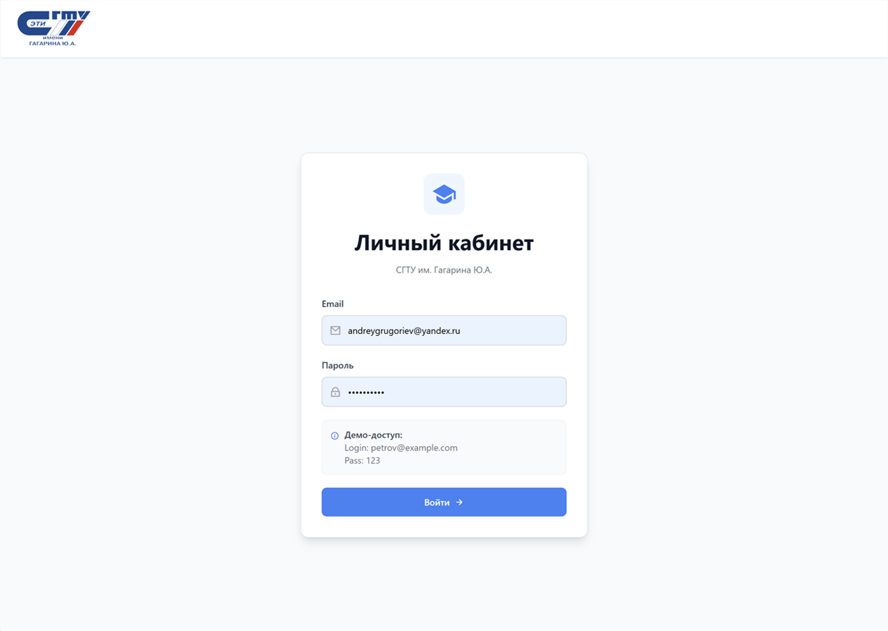
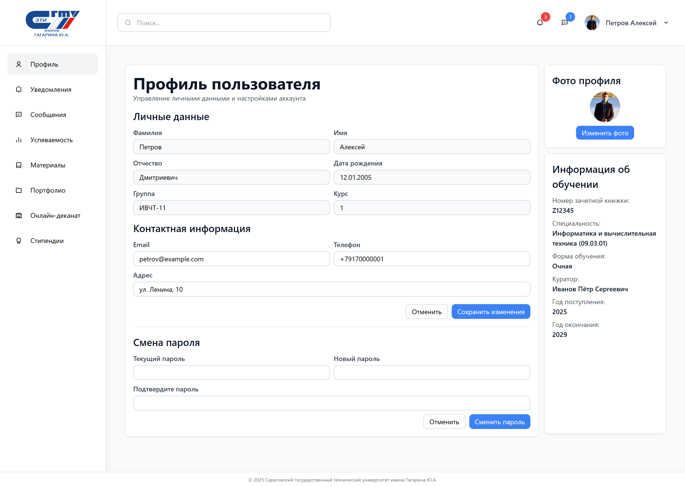
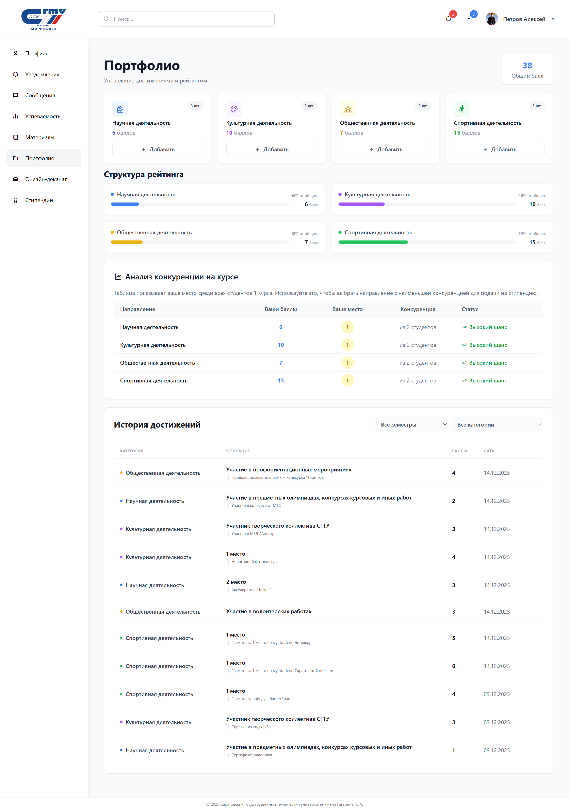

# 🎓 Личный кабинет студента ЭТИ СГТУ (Portfolio & Rating System)

Веб-информационная система для автоматизации учета достижений студентов и анализа академического рейтинга, разработанная в качестве курсового проекта по дисциплине «Базы данных».

## 🚀 О проекте

Проект представляет собой подсистему «Личный кабинет студента», которая позволяет студентам не просто просматривать свои данные, но и активно формировать свое цифровое портфолио. Главная особенность — расчет реального места в рейтинге среди сокурсников на основе балльно-рейтинговой системы вуза.

---

## 🖥️ Визуальная демонстрация

<div align="center" style="background-color:#0d1117; padding: 20px; border-radius: 15px;">

<h3 align="center" style="color:#fff;">🔐 Авторизация</h3>


<sub style="color:gray;">Безопасный вход в систему с привязкой к базе данных студентов</sub>
<h3 align="center" style="color:#fff;">👤 Профиль и личные данные</h3>


<sub style="color:gray;">Управление персональной информацией и визуализация данных об обучении</sub>
<h3 align="center" style="color:#fff;">🏆 Мастер добавления достижений</h3>

</div>

---

## 📋 Функциональность

* ✅ **Авторизация** — разграничение прав доступа и сессионная защита страниц.
* 👤 **Управление профилем** — редактирование контактов с клиентской валидацией (Regex) и смена аватара.
* 🛠 **Smart Portfolio Wizard** — интерактивная форма добавления достижений, исключающая ошибки пользователя.
* 📈 **Динамический рейтинг** — автоматический расчет баллов и позиции студента относительно курса.
* 🛡 **Database Integrity** — защита данных на уровне СУБД с помощью триггеров (запрет дублей документов, контроль отрицательных значений).
* 📊 **История достижений** — фильтрация и просмотр всех поданных заявок с их статусами.
* 📱 **Responsive Design** — полная адаптивность интерфейса благодаря Tailwind CSS.

## 🛠️ Технологии

### Backend:

* **Python / Flask** — серверная логика и маршрутизация.
* **PyMySQL** — взаимодействие с базой данных.
* **Jinja2** — серверный рендеринг шаблонов.

### Frontend:

* **Tailwind CSS** — современный UI-фреймворк.
* **JavaScript (Vanilla)** — логика мастера достижений и AJAX-запросы.
* **Remix Icons** — системные иконки.

### База данных (MySQL):

* **Хранимые процедуры** — высокопроизводительный расчет рейтинга на стороне сервера.
* **Триггеры** — бизнес-логика на уровне данных.

## ⚡ Быстрый старт

### Предварительные требования

* Python 3.9+
* MySQL 8.0+

### Установка зависимостей:

```bash
pip install Flask PyMySQL

```

### Настройка базы данных:

1. Создайте БД в MySQL.
2. Импортируйте SQL-скрипт из папки `database/Create_tables_SSTU.sql`.
3. Настройте подключение в `config.py`:

```python
host = "localhost"
user = "your_username"
password = "your_password"
port = 3306
db_name = "student_sstu"

```

### Запуск приложения:

```bash
python app.py

```

Адрес по умолчанию: `http://127.0.0.1:5000`

### 📁 Структура проекта

```text
student_portfolio/
│
├── static/               # Статика (CSS, изображения пользователя)
│   ├── css/              # Кастомные стили
│   └── uploads/          # Фото профилей
├── templates/            # HTML-шаблоны
│   ├── base.html         # Главный каркас сайта
│   ├── profile.html      # Страница профиля
│   └── portfolio.html    # Страница достижений и рейтинга
├── database/             # SQL скрипты, дампы БД и описание процедур
├── app.py                # Основной файл приложения (Flask)
├── config.py             # Конфигурация БД
└── README.md             # Описание проекта

```

### 👨‍💻 Разработчик

**Григорьев Андрей Сергеевич**

<p align="center"><sub>© Разработано в рамках курсового проектирования 2025 для ЭТИ СГТУ</sub></p>
